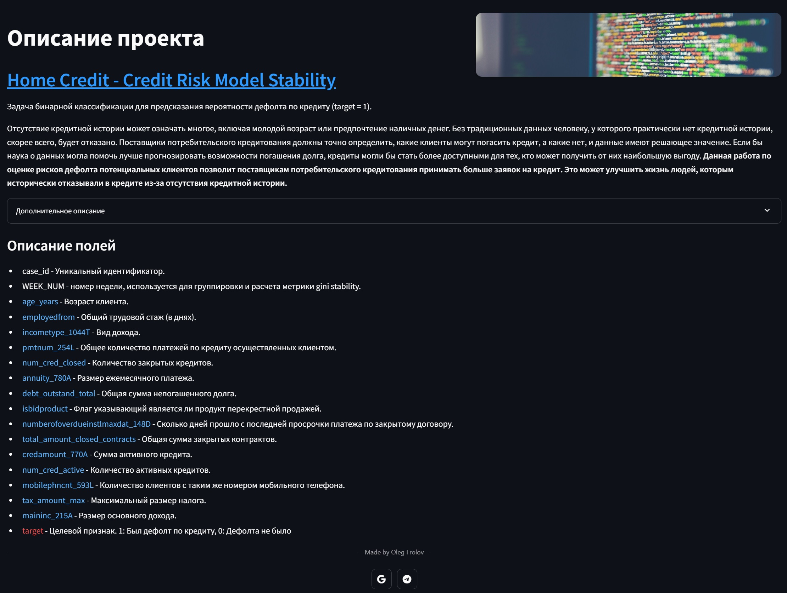
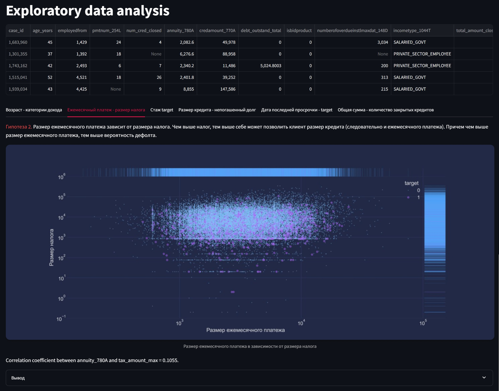
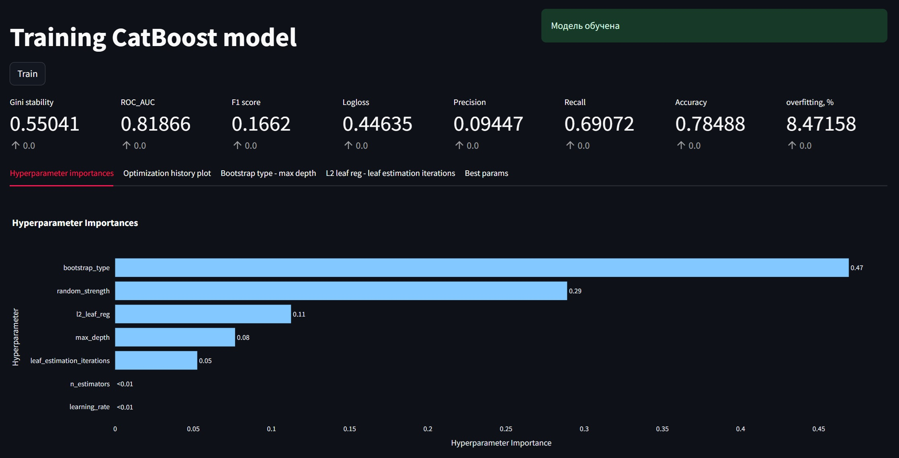
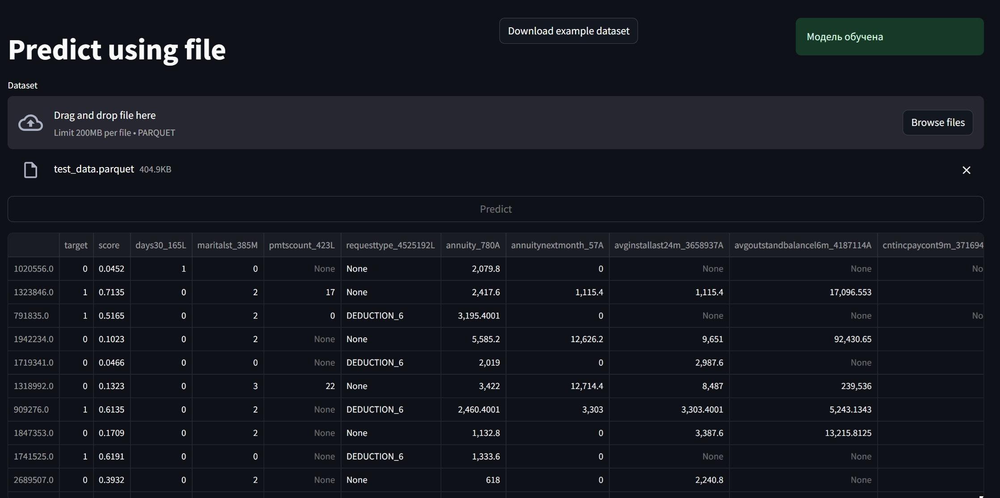
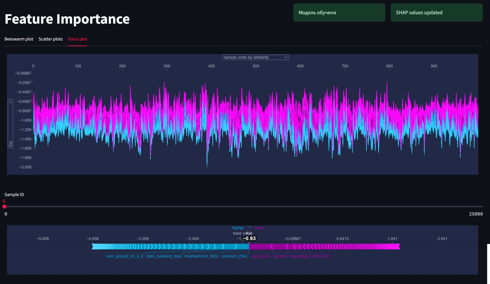
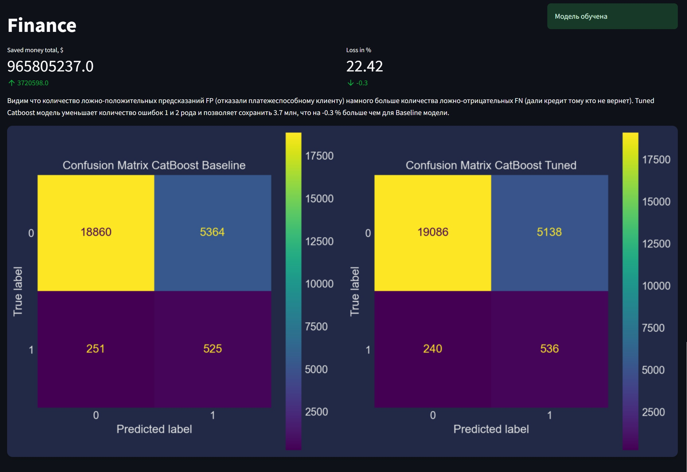

# Описание
Сервис для оценки вероятности дефолта по потребительскому кредиту с frontend и backend частью.
Backend часть с FastAPI имитирует сервер с реализующий операции обучения ML моделей, а также предсказаний и вычисления SHAP values.
Backend часть с streamlit выполняется на сервере, а frontend часть отображается в браузере. 
Проект запущен на сервере и доступен по ссылке http://103.45.247.209:8501/

## Description
Страница с описанием задачи, полей. Внизу имеется контактная информация автора.

## EDA
Страница с разведочным анализом. Содержит пример датасета, а также графики описывающие анализ по различным гипотезам.

## Train
Страница с обучением модели. Тут производится обучение CatBoost модели и вывод метрик и графиков optuna.

## Predict
Страница с получением прогноза по введенным данным в форме.

## Predict from file
Страница с получением прогноза для загруженного датасета. Имеется кнопка для скачивания примера данных.

## Feature importance
Страница с интерпретацией модели. Выводятся наиболее значимые признаки.

## Finance
Страница с упрощенным финансовым расчетом. Выводятся значения сохраненной суммы денег и процента потерь.

# Инструкция

## Основные команды для запуска FastAPI

- Запуск приложения из папки backend, где --reload - указывает на автоматическое обновление при изменении кода

`cd backend`

`uvicorn main:app --port=8000 --reload`

Доступ к сервису FastAPI, при условии, что прописали ранее 8000 порт
http://localhost:8000/docs
___

## Основные команды для запуска Streamlit

Запускается после backend в отдельном терминале

`cd frontend`

`streamlit run main.py`

Доступно будет по адресу http://localhost:8501
___

## Основные команды Docker

- Отдельный контейнер для frontend

`docker build -t streamlit:ver1 frontend -f frontend/Dockerfile`

- Отдельный контейнер для backend

`docker build -t fastapi:ver1 backend -f backend/Dockerfile`

___

## Docker Compose

- Сборка на сервере через ssh:

`docker context create dev --docker "host=ssh://example@example.example.com"`

`docker-compose --context dev up -d --build`

Копируем файлы в volumes

- `docker --context dev run -v mlops_credit_risk_config:/data --name helper busybox true`
- `docker --context dev cp config/. helper:/data`
- `docker --context dev rm helper`

- `docker --context dev run -v mlops_credit_risk_media:/data --name helper busybox true`
- `docker --context dev cp media/. helper:/data`  
- `docker --context dev rm helper`

- `docker --context dev run -v mlops_credit_risk_report:/data --name helper busybox true`
- `docker --context dev cp report/. helper:/data`  
- `docker --context dev rm helper`

- `docker --context dev run -v mlops_credit_risk_models:/data --name helper busybox true`
- `docker --context dev cp models/. helper:/data`  
- `docker --context dev rm helper`

- `docker --context dev run -v mlops_credit_risk_data:/data --name helper busybox true`
- `docker --context dev cp data/. helper:/data`  
- `docker --context dev rm helper`

- `docker --context dev run -v mlops_credit_risk_cached:/data --name helper busybox true`
- `docker --context dev cp cached/. helper:/data`  
- `docker --context dev rm helper`

- Сборка сервисов из образов внутри backend/frontend и запуск контейнеров в автономном режиме

`docker compose up -d --build`

И дальше копируются файлы как выше только без --context dev
___
## Folders
- `/backend` - Папка с проектом FastAPI
- `/frontend` - Папка с проектом Streamlit
- `/config` - Папка, содержащая конфигурационные файлы
- `/data` - Папка, содержащая исходные данные, обработанные данные, уникальные значения в формате JSON, а также неразмеченный файл для подачи на вход модели
- `/models` - Папка, содержащая сохраненную модель после тренировки, а также объект study (Optuna)
- `/notebooks` - Папка, содержащая jupyter ноутбуки с предварительным анализом данных
- `/report` - Папка, содержащая информацию о метриках после обучения
- `/cached` - Папка c кэшированными рисунками и shap values
- `/media` - Папка c различными рисунками
